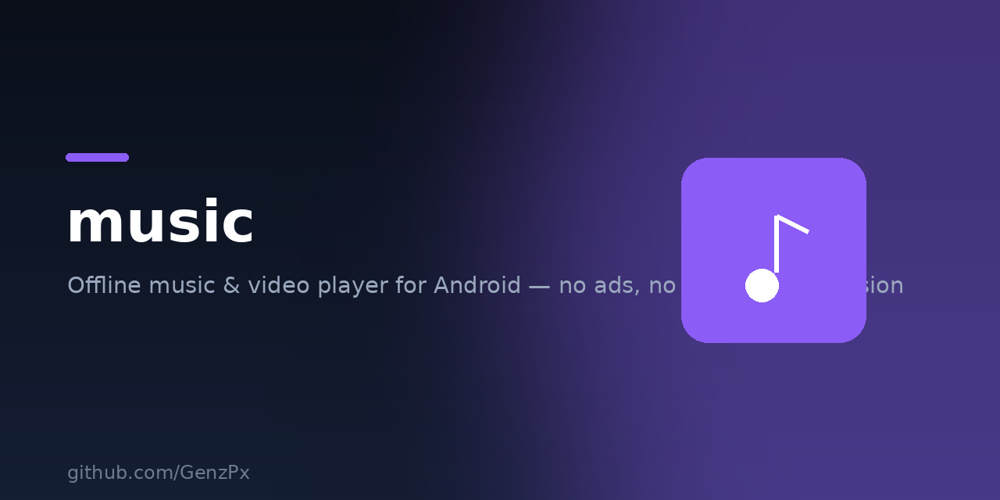

<p align="center">
  
</p>

# Music & Video

Dua pemutar media offline untuk Android. Tanpa iklan, tanpa login, tanpa akun.

Dibuat karena aplikasi Musik dan Video bawaan ColorOS di Indonesia menampilkan
iklan setiap kali dibuka, dan toggle penyembunyi iklan yang tersedia di
sebagian negara lain tidak ada di region ini.

| Aplikasi | Isi |
|---|---|
| **Music** | Pemutar musik lokal |
| **Video** | Pemutar video lokal |

Keduanya berdiri sendiri dan bisa dipasang terpisah.

---

## Tanpa izin INTERNET

Ini bukan janji, ini dipaksa sistem operasi.

Kedua aplikasi **tidak mencantumkan `android.permission.INTERNET`** di
`AndroidManifest.xml`. Tanpa izin itu, Android melarang aplikasi membuka
koneksi jaringan apa pun di level kernel — walaupun ada kode yang mencoba.
Konsekuensinya:

- Iklan tidak bisa dimuat, karena harus diunduh dari server
- Data penggunaan tidak bisa dikirim keluar
- Tidak ada pembaruan diam-diam yang menambahkan iklan

Modul Video memakai Media3 ExoPlayer, dan pustaka itu bisa menyertakan izin
INTERNET lewat penggabungan manifest. Karena itu manifestnya memuat
`tools:node="remove"` yang membuang izin tersebut secara paksa dari APK akhir,
dan modul jaringan Media3 memang tidak dipakai sama sekali.

Silakan buktikan sendiri setelah memasang:

**Pengaturan → Aplikasi → Music (atau Video) → Izin**

Setiap build di CI juga memeriksa kedua APK. Kalau salah satu meminta izin
internet, build langsung digagalkan sebelum dirilis.

---


### Baru di Music 1.1

- **Layar Now Playing penuh** — pemutar mini di bawah tetap ada; menekannya kini membuka layar penuh (sampul besar, backdrop gradasi dari warna album, geser posisi, antrean).
- **Perbaikan crash** saat pemutar mini ditekan.
- **Urutkan lagu** — judul, artis, album, tanggal ditambahkan, atau durasi; naik atau turun.
- **Favorit** — tahan lagu atau ketuk hati di layar Now Playing.
- **Daftar putar** — buat, ganti nama, hapus; semuanya tersimpan lokal.
- **Baru diputar** — riwayat 100 lagu terakhir.
- **Jadikan nada dering** langsung dari tahan-lagu.
- **Timer tidur** dan pintasan **equalizer** sistem.

## Video

| | |
|---|---|
| Format luas | MP4, MKV, WebM, AVI, HEVC, AV1, dan lainnya lewat Media3 ExoPlayer |
| Jelajah | Semua video atau per folder, tampilan petak atau daftar |
| Gestur | Geser kiri untuk kecerahan, kanan untuk volume, mendatar untuk maju mundur |
| Ketuk dua kali | Sisi kiri mundur sepuluh detik, kanan maju, tengah jeda |
| Lanjutkan | Kembali ke posisi terakhir, dengan indikator kemajuan di daftar |
| Subtitle | Trek di dalam berkas, bisa dipilih atau dimatikan |
| Jalur audio | Berpindah bahasa pada berkas bertrek ganda |
| Kecepatan | 0,5x sampai 2x |
| Rasio | Muat layar, perbesar, atau penuhi layar |
| Layar mengambang | Picture in Picture, opsional |
| Audio saja | Lanjutkan suaranya saat keluar aplikasi, opsional |
| Kunci layar | Cegah sentuhan tidak sengaja saat menonton |
| Urutkan | Terbaru, nama, ukuran, atau durasi |

---

## Music

| | |
|---|---|
| Pindai otomatis | Membaca lagu dari MediaStore, tanpa perlu atur folder |
| Jelajah | Tab Lagu, Album, Artis, dan Folder |
| Pemutaran latar | Tetap jalan saat layar mati, kontrol di notifikasi & layar kunci |
| Kontrol media | Tombol headset dan Bluetooth berfungsi |
| Antrean | Acak, ulangi satu, ulangi semua |
| Cari | Judul, artis, album |
| Lanjutkan | Buka lagi aplikasi, lanjut di detik terakhir |
| Timer tidur | 15 / 30 / 45 / 60 / 90 menit |
| Equalizer | Memakai equalizer bawaan sistem |
| Tema | Terang, gelap, atau ikut sistem |
| Antrean terlihat | Ketuk "Lihat antrean" untuk melompat ke lagu mana pun |
| Info berkas | Tahan sampul di layar pemutar untuk melihat lokasi berkas |
| Maju cepat | Ketuk dua kali sampul untuk maju 10 detik |
| Panduan latar belakang | Bantuan melonggarkan pembatasan bawaan ROM, sesuai merek |

Otomatis jeda saat headset dicabut, dan saat ada telepon masuk atau aplikasi
lain memutar suara.

### Kalau musik sering berhenti sendiri

Banyak ponsel — terutama Xiaomi, OPPO, realme, vivo, dan Infinix — menghentikan
aplikasi latar belakang secara agresif demi menghemat baterai. Ini memengaruhi
semua pemutar musik, bukan hanya aplikasi ini.

Aplikasi mendeteksi sendiri kalau pemutarannya pernah dihentikan paksa. Setelah
terjadi dua kali, muncul kartu saran berisi panduan yang sudah disesuaikan
dengan merek ponsel, lengkap dengan tombol pintas ke halaman setelan terkait.

Kartu itu bisa ditutup permanen, dan panduannya tetap bisa dibuka kapan saja
lewat **Menu → Jaga musik tetap jalan**. Aplikasi tidak pernah mengubah setelan
sistem sendiri.

Langkah tercepat di hampir semua merek: buka **Aplikasi Terkini**, tahan kartu
Music, lalu tekan ikon **gembok**.

| Merek | Jalur setelan |
|---|---|
| Xiaomi / Redmi / POCO | Kelola aplikasi → Music → Hemat baterai → Tanpa batasan, lalu Mulai otomatis |
| OPPO / realme | Baterai → Konsumsi daya latar belakang, dan Izin mulai otomatis |
| vivo / iQOO | Baterai → Konsumsi daya tinggi latar belakang, dan Mulai otomatis |
| Samsung | Baterai → Batas penggunaan latar belakang → Aplikasi tidak pernah tidur |
| Huawei / Honor | Baterai → Peluncuran aplikasi → Music → Kelola manual |
| Infinix / Tecno / itel | Phone Master → Penghemat daya → lindungi Music |
| Pixel / Nothing / Motorola | Info aplikasi → Baterai → Tanpa batasan |

---

## Unduh

APK tersedia di halaman [Releases](../../releases).

Cara pasang:

1. Unduh berkas `.apk` versi terbaru
2. Buka lewat pengelola berkas di HP
3. Kalau muncul peringatan, izinkan "Instal aplikasi tak dikenal"
4. Buka aplikasi dan beri izin baca file audio

Aplikasi ini tidak menggantikan aplikasi bawaan — keduanya bisa terpasang
bersamaan.

**Minimal Android 7.0 (API 24).** Diuji pada target Android 14 (API 34).

---

## Build sendiri

```bash
git clone https://github.com/GenzPx/music.git
cd music
./gradlew :music:assembleRelease :video:assembleRelease
```

Butuh JDK 17 dan Android SDK (compileSdk 34).

Hasilnya ada di `music/build/outputs/apk/release/` dan
`video/build/outputs/apk/release/`.

### Menandatangani rilis

Supaya update APK berikutnya bisa menimpa versi lama, gunakan keystore yang
sama setiap kali. Buat sekali:

```bash
keytool -genkeypair -v -keystore release.jks \
  -alias music -keyalg RSA -keysize 2048 -validity 10000
```

Lalu simpan di GitHub sebagai repository secrets:

| Secret | Isi |
|---|---|
| `KEYSTORE_BASE64` | Hasil `base64 -w0 release.jks` |
| `KEYSTORE_PASSWORD` | Kata sandi keystore |
| `KEY_ALIAS` | `music` |
| `KEY_PASSWORD` | Kata sandi kunci |

> Simpan berkas `release.jks` baik-baik dan jangan pernah di-commit.
> Kalau hilang, update berikutnya tidak bisa menimpa versi terpasang —
> pengguna harus copot pasang dulu.

### Merilis versi baru

```bash
git tag v1.0
git push origin v1.0
```

GitHub Actions akan membangun kedua APK, memverifikasi tidak ada izin
internet pada masing-masing, lalu membuat Release otomatis.

---

## Teknis

- Java, tanpa Kotlin — APK lebih kecil, build lebih cepat
- Music memakai `MediaPlayer` + `MediaSessionCompat`, tanpa ExoPlayer
- Video memakai Media3 ExoPlayer tanpa modul jaringan
- Tanpa analitik, tanpa crash reporter, tanpa SDK iklan
- Music sekitar 1,6 MB; Video sekitar 5 MB

---

## Lisensi

GPL-3.0 — lihat [LICENSE](LICENSE).

Artinya siapa pun boleh memakai, mempelajari, dan memodifikasi kode ini,
tetapi versi yang disebarluaskan wajib tetap sumber terbuka dengan lisensi
yang sama. Ini disengaja: supaya tidak ada yang mengambil kode ini lalu
merilisnya kembali dengan iklan di dalamnya.

Dibuat oleh **GenzPx**.

### Baru di Video 1.2

- **Favorit** — tahan video di daftar, atau lewat menu saat memutar. Video favorit dapat tanda hati di gambar mini.
- **Riwayat tontonan** — 100 video terakhir, tercatat otomatis.
- **Lanjutkan menonton** — daftar tontonan yang belum selesai lengkap dengan posisinya, sekali ketuk langsung lanjut.
- **Timer tidur** — 15/30/45/60/90 menit, video dijeda sendiri.
- **Kunci anak** — layar benar-benar mati sentuh, dibuka dengan menahan ikon gembok. Tombol kembali juga ikut dikunci.
- **Ulang bagian A-B** — tandai dua titik, bagian itu diputar berulang.
- **Zoom cubit** — perbesar gambar sampai 3x dengan dua jari.
- **Ukuran subtitle** bisa diatur 75%–200%.
- **Tahan video** untuk favorit, lanjutkan dari posisi, putar dari awal, bagikan, dan info berkas.
- Setelan baru: matikan "lanjutkan dari posisi terakhir" dan "layar tetap menyala".

